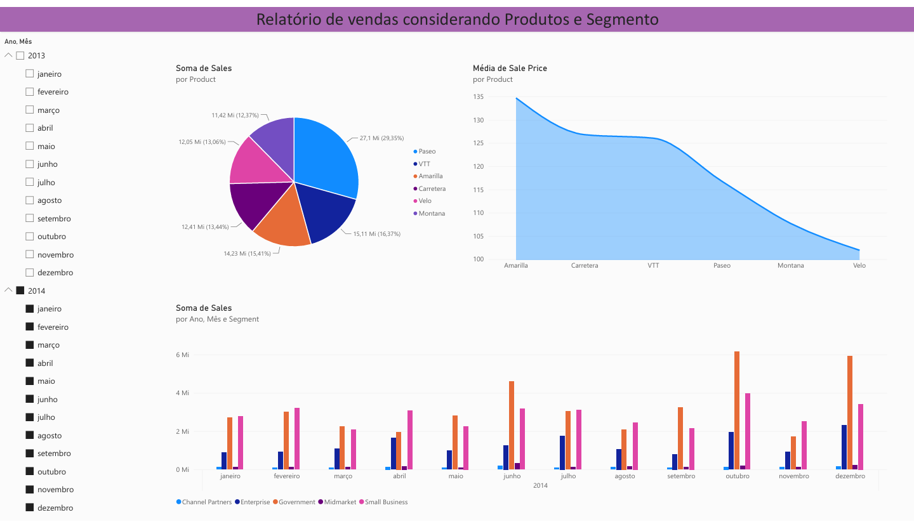

# 📊 Dashboard de Vendas — Power BI

## 🎯 Objetivo do projeto

Este projeto foi desenvolvido durante um curso da DIO com o objetivo de praticar conceitos de análise e visualização de dados.

A proposta foi utilizar uma base de dados de vendas no Excel e transformá-la em informações visuais e indicadores por meio do Power BI.

O dashboard permite analisar dados relacionados a vendas, produtos, segmentos, países, lucro e unidades vendidas, facilitando a interpretação das informações e a identificação de resultados.

## 🛠️ Tecnologias utilizadas

- Microsoft Excel — utilizado como base de dados;
- Power BI — utilizado para tratamento, análise e visualização dos dados;
- GitHub — utilizado para documentação e construção do portfólio.

## 📊 Análises realizadas

O dashboard apresenta análises relacionadas a:

- Vendas por produto;
- Vendas por país;
- Vendas por segmento;
- Lucro por país;
- Lucro por segmento;
- Unidades vendidas;
- Evolução das vendas ao longo do tempo;
- Comparação de indicadores por período.

## 📈 Dashboard

O projeto apresenta visualizações desenvolvidas no Power BI para facilitar a análise dos principais indicadores de vendas e desempenho.

## 📚 O que aprendi

Durante o desenvolvimento deste projeto, pude praticar:

- Organização de uma base de dados;
- Análise de informações de vendas;
- Criação de indicadores;
- Construção de gráficos e visualizações;
- Utilização do Power BI para criação de dashboards;
- Interpretação de dados;
- Apresentação de informações de forma visual;
- Documentação e organização de um projeto no GitHub.

## 🚀 Próximos passos

Pretendo continuar desenvolvendo meus conhecimentos na área de Dados, estudando ferramentas e tecnologias como:

- SQL;
- Python;
- DAX;
- Modelagem de dados;
- Business Intelligence.

## 👩‍💻 Sobre mim

Sou estudante de Análise e Desenvolvimento de Sistemas e tenho interesse em construir minha carreira na área de Dados e Business Intelligence.

Atualmente, estou desenvolvendo meus conhecimentos em Excel e Power BI e utilizando projetos acadêmicos e de cursos para construir meu portfólio e colocar meus aprendizados em prática.
